# Agile Development Processes Postmortem Report

## Team 7

 * Goitom Abrehaley
 * Tobias Alldén
 * Rahwa Araya
 * Pooriya Balavi
 * Alexander Graham
 * Erik Karlkvist
 * Johan Ljungberg

---

# Reflections
The group’s overall impression of the project is positive. The team not only learned and expanded their knowledge regarding agile practices but also learned the fundamentals of creating a mobile app, using the React Native framework.
The team adopted the essential practices of agile to develop the application that helped the project go forward smoothly and allowed the team to cope with changes very well. Practices such as pair programming, prototyping, test-driven development, refactoring, continuous integration and scrum board were crucial in accomplishing the project.

## Pair Programming
Pair programming was largely utilized in the earlier phases of the project and served as a means for the team members to get familiar with the framework as only one of the team members had previous experience. The idea was to speed up the learning process by combining the knowledge team members had collected from reading up on the framework.

One of the main advantages of pair programming is that the code will supposedly be of a much higher quality than if a single programmer were to write the code. This is due to the other, monitoring programmer, who can spot potential errors and technical debt that may find its way into the code. This is more effective once both programmers are knowledgeable in the frameworks and language they are working in. As such, given that most of the team were unfamiliar with the framework we might as such not have noticed the full set of advantages related to pair programming, but it did help us get familiar with the framework faster. A side advantage of this is it also helped us to get to know and understand the team faster.

As the project went forward and members were assigned to their own tasks, pair programming started to evolve in format. Each person would write code for specific tasks until the next sprint and if they had any issues, they discussed it during the next meeting, getting help from team members. This allowed a rather quick and effective pair programming session for the group where it made members work together when it was necessary.

## Scrum Board
The scrum board proved to be a very valuable asset to our team during the project. The board allowed us to keep track on the current state of the project such as completed tasks, tasks in progress, etc... It allowed for a backlog where new ideas and items delayed to future sprint could reside. As such, the scrum board was one of the central practices used in the project.

The scrum board was realized using Trello as we did not have the necessary resources for a physical scrum board. The online version gave the same functionality as a physical one would. However, there were some drawbacks with the board, such as people forgetting to update the cards. One example of this was when several people would work on the same task as the individual that had initially taken on finishing the task had forgot to update the task to "in progress" on the board. This caused unnecassary duplicate work and potential delays to the project. On the positive side, these duplications of work were often discovered early and did as such not cause too much of a distraction to the project. Having a physical scrum board could potentially fix this issue as a developer could physically "take" the task if it were written on, for example a post-it note. Overall the board was an extremely important feature to the team.

## Scrum Meeting
Throughout the entire project we found scrum meetings the most important and useful agile practice. In each meeting, every group member has participated and tried to share their experiences and challenges faced. Moreover, this practice was useful in determining challenges that developed during the project work and enabled us to figure out which tasks were requiring more work/time. It was vital to facilitate the development of the project iterations and track the project progress.

During these meetings, the members not only talked about the problems they were facing but also their achievement and what they have learnt. Members also reviewed each other’s progress and gave feedback, especially when it came to the user interface and designs.

## Product Owner/customer
Meeting the customer on set dates pushed the team members to be accountable for their work and take more responsibility with their tasks. This consequently made the team work together to accomplish the tasks on the backlog in order to satisfy the customer and get feedback in order to develop the application in regard to customer’s preferences. Having meetings regularly was particularly useful as it meant the customer could change their mind about decisions without massive setbacks in terms of workload.

## Code ownership and refactoring
During the earlier sprints the responsibility of setting up the GitHub version control and continuous integration builds tools, such as Travis was under the responsibility of specific group members given that most of the group members were new to GitHub version control and the React Native framework. As we could proceed with the later sprints this responsibility was shared amongst all group members.

Throughout all sprints, we worked through the features listed in the backlog. The team could prioritize and select specific modules for each sprint. Every group member was given the freedom to choose a task to work with from the to-do catalogue.

 After the task was completed the team was using collective code ownership. i.e. anyone within the team was given the right to modify the module as far as he/she could enhance its features/there was no strict “ok” requirement from the module owner to modify it. This had its own positive and negative sides. To start with positive side, every module was not under the sole control of a specific group member, if any group member thought something was missed and wanted to add it, he /she was able to do it easily with no more restrictions. This might have helped us, if any one of our team member was not able to complete the course. From the negative side, when a group member used to modify a specific module, other modules dependent on that module could get errors.

Our experience with the project really complements with the literature, for example where it says “during collective code ownership anyone on the team can improve any part of the system at any time. But one of the worst risks is a general degradation due to inconsiderate extensions (“creeping featurism”).

 Finally, even though the team has tried its best to implement refactoring, such as pulling out common modules to a separate module to avoid duplications here and there, we haven’t followed strict coding standards. Some examples of these include: 
  * Some files are named using camelCase, and some using underscores. 
  * Indentation is also heavily inconsistent, in some places two spaces were used, but in others 4 space was used. 
  * The spacing issue is most likely due to the team was using different text editors. 
These problems could have been largely combated by defining code and naming conventions at the beginning of the project and by having code reviews during the development cycles. This counteracts with the literature where it comments, “agile methods include the idea that teams should adhere to strict coding standards to help quality”.

## Testing
Considering that there were no complicated computation in the application, testing was mainly usable when the data was being fetched from the database. For this purpose, test cases were written using Travis where we tested user login and CRUD (Create, Read, Update and Delete functions) for Events, News, Teams and Games as well as rendering tests for the main views of the app.

Additionally, most of the backend code is carried out by the Firebase library where it was not testable. For this reason, functions used in Firebase were mocked to be able to be test. Even though this process took extra time and effort, the team learned how to setup a testing environment for react native, as well as creating mock-ups during the development of the application.

We realised during the project that test driven development is not really a feasible practice for all types of software development, and can in some cases actual harm the development process. In our case, we were trying to really do some test driven development but due to issues with travis and lack of testable code, we never had the chance. The code that we finally tested was already written by the time we were ready to do test driven development, and waiting for travis to be fixed would have stalled our progress a lot, since nobody could work before they had data to display. This realisation is also observed in the course book, where the author ranks test driven development as one of the bad and ugly practices.

## Continuous Integration
One of the advantages of using Git was it allowed us to integrate quickly and easily. We could merge branches, see where conflicts occurred and make amendments where required. We did this regularly as a group (between every few hours to every day we worked on the project). Towards the beginning of the project we started with many development branches, however we were finding the code was too widespread and taking longer to put the project together. By the end of the project we were down to about three branches, allowing work on major projects (such as the Maps view) without distrupting others workflow.

Ultimately, we found continuous integration useful as it allowed us to see, physically how the project was coming together.

## Communication channel
We found Slack was the most important communication channel as it allowed us to communicate independant of our location. 

Another important communication channel was verbally in person. We had group code sessions in the same room which made communication much easier. This eliminated hold ups as we weren't waiting for responses like you would with Slack. Finally, it allowed for more innovative solutions to problems as there was a lot of input and discussion.

# Project outcome
## Concept of project:
We were given the task to create a software tool for a football cup. This tool would then be used by tourists and fans so they could keep track of things like results, upcoming games, restaurants and shops in the area etc. An admin should be able to manage the content (news, games, results etc.) through the same application.

Our final product is a smartphone application which cover all those areas. It can show news, events, games, a table and a map with all happenings placed. An admin can log in and edit stuff that exist in the app and also add new stuff through an admin view. We have also added functionality for a user to follow teams to see information about them and the players in the squad. There is also a homepage which shows a few games, news and the top teams in the table.
## Frameworks used:
The application is built using React Native, which is a front-end framework for building applications. The framework is an extension from the React framework which was created to be able to develop fast and modern web pages. The framework is built using javascript and allows for writing cross platform code for iOS and Android with very little native modifications and as such may reduce the development time for developing cross platform applications as there is no need to write two separate versions.

The back end of the application is handled via Firebase which is a modern database solution that is easy to handle and scales easily. Further, as the setup is rather simple for Firebase the time nessesary for enviroment setup was reduced, increasing the time available for work on the actual application.

## Application walkthrough:
In this section we will describe the application at it currents stage, discuss the different screens and how the functionality works. We will start off with the main tab navigator and the screens in it. All data shown in the screenshots are retrieved from a live database that we created.

  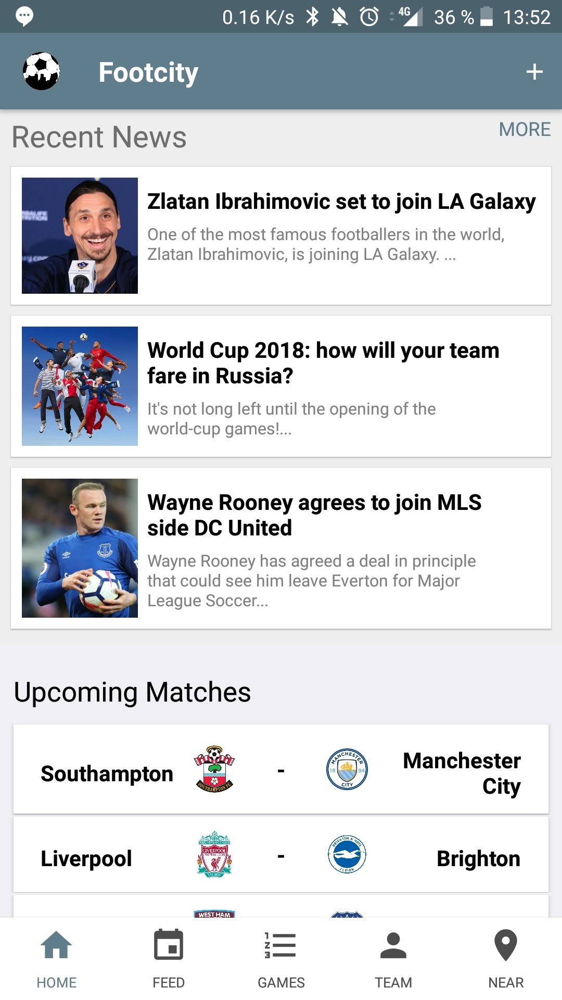
  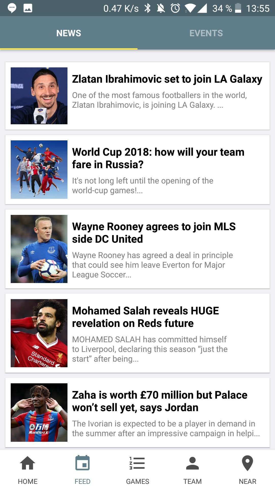
  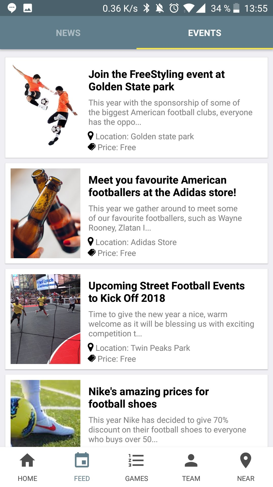

The left image above this text displays the home page. In the tab bar at the bottom the "Home"-tab with the house icon is highlighted with the app colour, which is a dark blue/grey colour. Each view in the app has a header, displaying where in the application you are. Since this is the home screen, the app logo and name is in the header. The plus sign is for admin functionality, where you can login and add things like news, events, etc. The content of the main screen is basically a summary of other tabs. At the top you can see the latest news, after that upcoming matches are shown, followed by the latest matches. At the bottom of the main screen the top 5 teams are shown.

The middle screen displays the latest news, and the screen to the right displays upcoming events. These are both tabs in the tab feed. We initially wanted the events to be dependent on the teams you followed, but they ended up being more general events for everyone. These are all managed by the admin who can create, update and delete events and news. The admin also manages teams, games and players.

  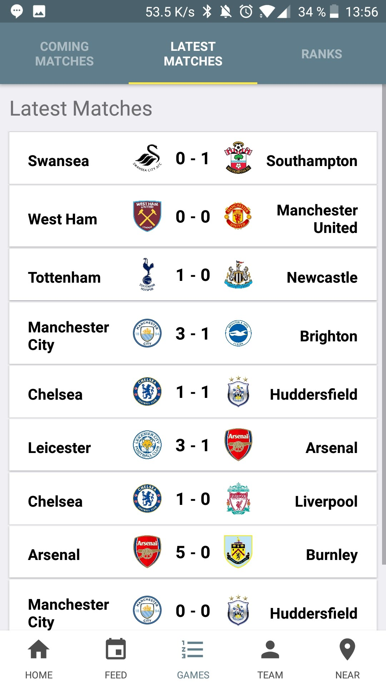
  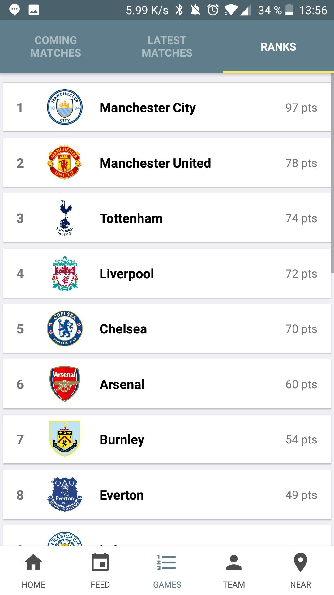
  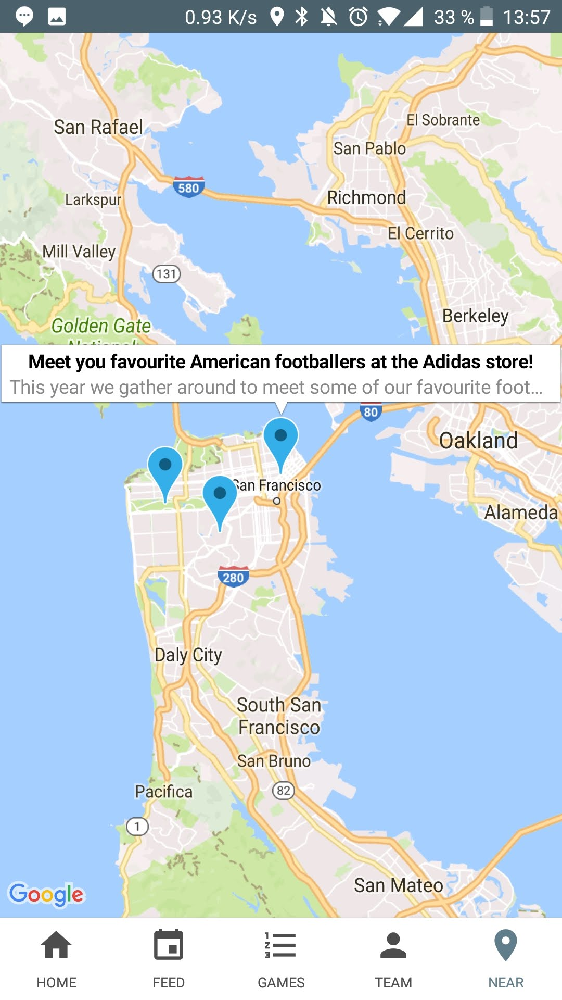

The left screen below displays the latest matches and their scores. This is part of the Games tab, where Upcoming Matches, Latest Matches and Ranks are sub-tabs. The Upcoming matches looks like the latest matches, but since they haven't been played yet they do not have scores. Clicking on any of these games will open a detailed view of the game where you can read a description of the game, the location and date. The middle screen above depicts the ranks that the teams currently has, which is based on the scores the team has accumulated this far.

The screen to the right is the maps view, where you can see where your position is and where the events positions are. The blue markers are event locations, and they use latitude and longitude information stored in the database for location mapping. We used Google maps for this since it is free and highly documented.

  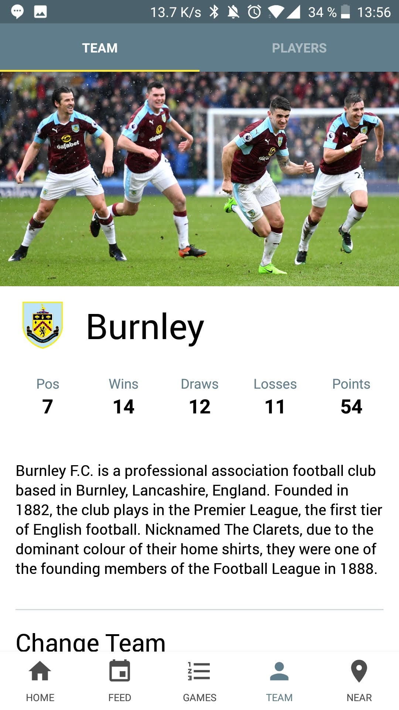
  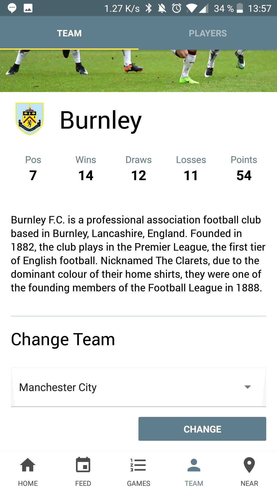
  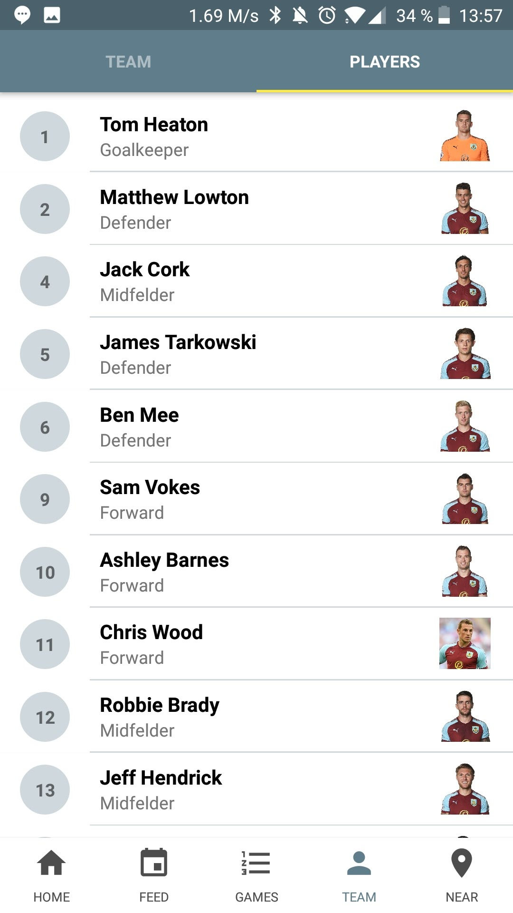

These screens above are all from the teams tab. The left and middle are both from the sub-tab Team, where you can see your team's stats like wins, losses and rank, together with a description of the team. The middle screen is the same tab but scrolled down, and shows the change team selector. If you change team the new team's data will be visible, and you will be marked as supporting that new team instead. The screen to the right display the players in each team, with their name, image, position and number. We have over 400 players added manually to the database.

  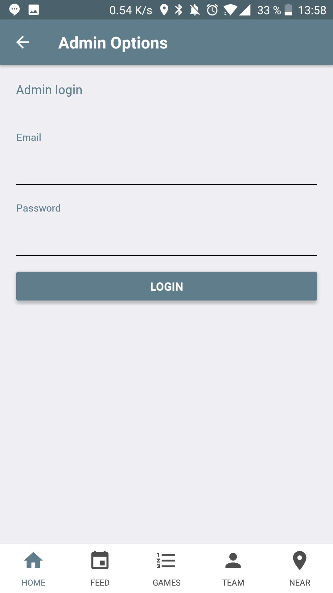
  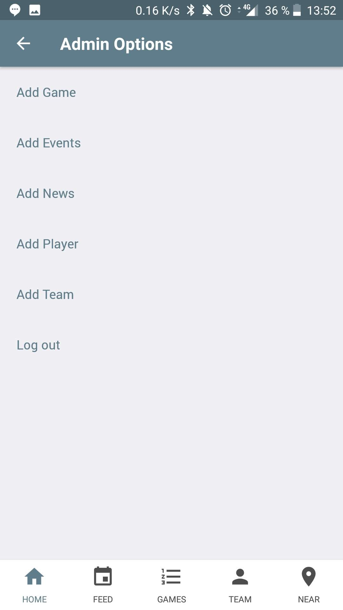
   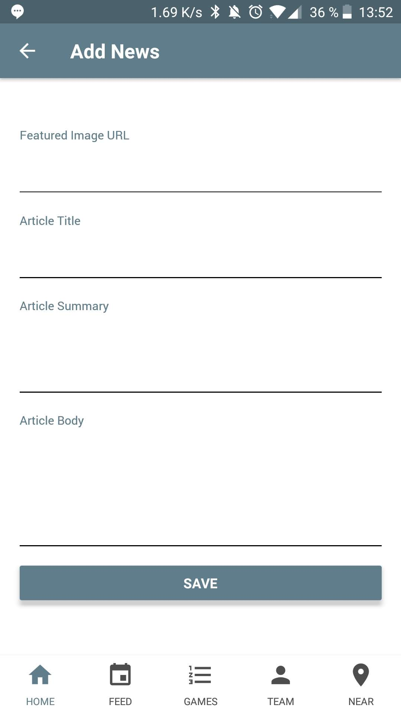

The last part of the app are admin functions. The screens above show what the admin can do. The left screen is a simple login, which is the first thing you see when clicking on the plus sign on the Home-page. Once the admin successfully logins, they are redirected to the middle screen where they can choose to add something new. The screen to the right show how the add news screen looks like. The other add screens look very similar. The admin only needs to log in once, and then they are kept logged in even if they close the app. The screens contain all the input for adding a new news article. One issue with the current design is adding images, since you must find an image online and then copy that URL into the app for it to work. We would like to be able to upload images to the database, however this was too complex for this project.  

  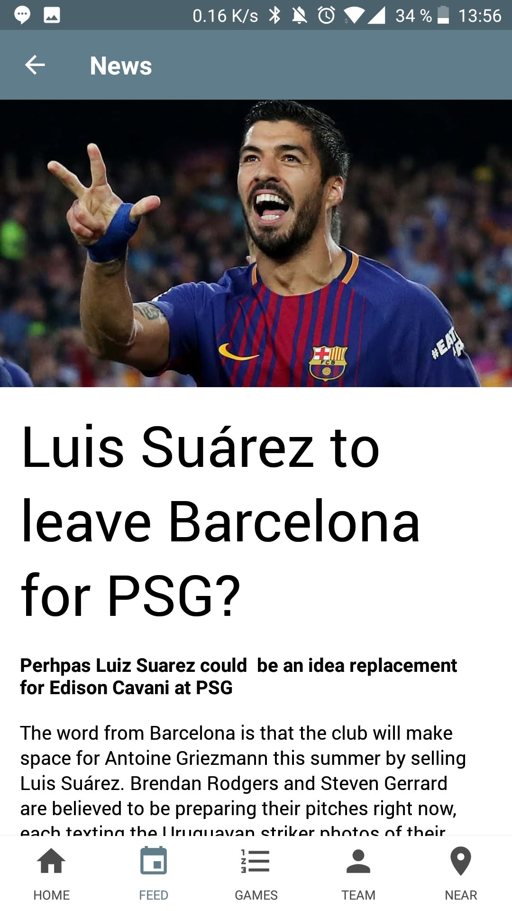
  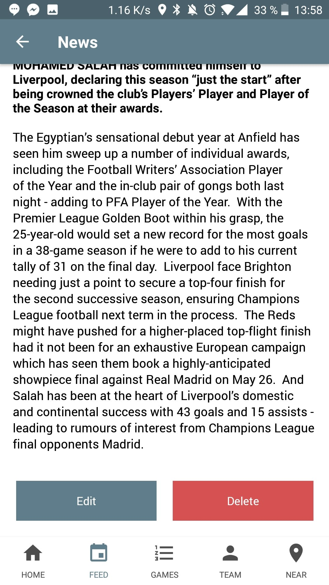
   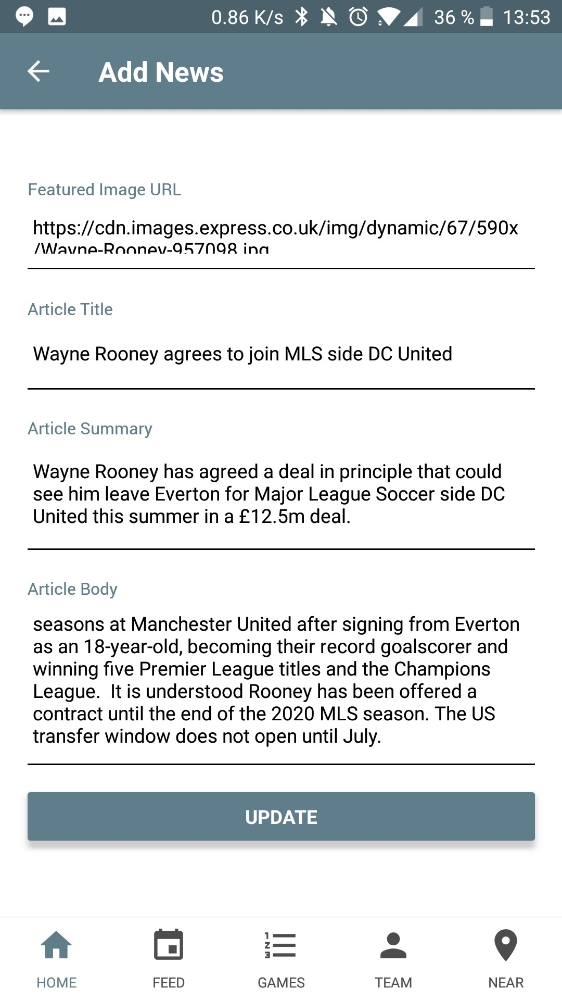

The last unique screens in the app are the detailed views. The left and middle one both depict a detailed view of a news article. The detail view of events and games look similar. The middle screen shows the bottom of the news detail, and once the admin has logged in they can edit and delete it there. If they press edit, the same screen as before where you add a new news article appears, however this time the data is filled with the current data. The admin can edit any input here and then hit update to update the news article on the database.
